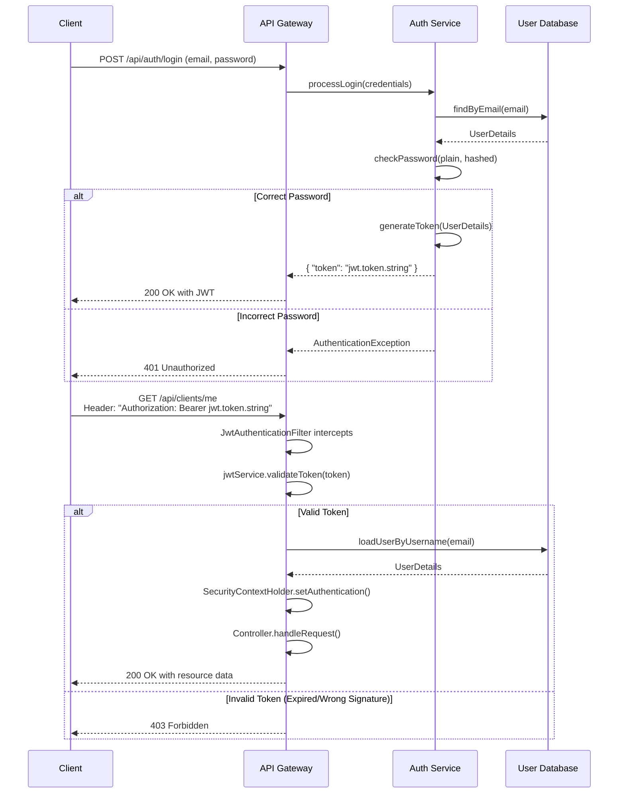

# Authentication Guide with Spring Security and JWT

**Project:** Understand Your Electricity Bill
**Date:** 2025-12-23

---

## 1. Overview

This document describes the authentication strategy for the backend API using **Spring Security** and **JSON Web Tokens (JWT)**. The goal is to protect the API endpoints, ensuring that only authenticated users can access protected resources.

The approach is **stateless**, meaning the server does not store session information. Each client request must contain a valid JWT to be authorized.

### Why JWT?

-   **Stateless:** Ideal for microservices architectures and RESTful APIs. It reduces server load as there is no need to manage sessions.
-   **Security:** Tokens are digitally signed, ensuring their integrity and authenticity.
-   **Portability:** JWT is an open standard (RFC 7519) and can be used across different platforms and technologies.

---

## 2. Core Components

Our security implementation is built on three main pillars:

1.  **`SecurityFilterChain`**: The central configuration that defines security rules and the filter chain.
2.  **`JwtAuthenticationFilter`**: A custom filter that intercepts each request to validate the JWT.
3.  **`jjwt` Library**: A Java library for creating, signing, and validating JWTs.

### 2.1. `SecurityFilterChain`

The `SecurityFilterChain` is a Spring bean that defines how HTTP requests are handled by the security layer. It allows us to configure which endpoints are public, which are protected, and how authentication is processed.

**Responsibilities:**

-   Disable CSRF (Cross-Site Request Forgery), as we are not using cookie-based sessions.
-   Set the session management policy to `STATELESS`.
-   Configure authorization rules for endpoints (e.g., allow access to `/api/auth/**` and require authentication for `/api/clients/**`).
-   Add our custom `JwtAuthenticationFilter` to the Spring Security filter chain.

**Configuration Example (`SecurityConfig.java`):**

```java
import org.springframework.context.annotation.Bean;
import org.springframework.context.annotation.Configuration;
import org.springframework.security.config.annotation.web.builders.HttpSecurity;
import org.springframework.security.config.annotation.web.configuration.EnableWebSecurity;
import org.springframework.security.config.http.SessionCreationPolicy;
import org.springframework.security.web.SecurityFilterChain;
import org.springframework.security.web.authentication.UsernamePasswordAuthenticationFilter;

@Configuration
@EnableWebSecurity
public class SecurityConfig {

    private final JwtAuthenticationFilter jwtAuthFilter;
    private final AuthenticationProvider authenticationProvider; // Provided by Spring

    // Dependency injection via constructor

    @Bean
    public SecurityFilterChain securityFilterChain(HttpSecurity http) throws Exception {
        http
            // 1. Disable CSRF for a stateless API
            .csrf(csrf -> csrf.disable())

            // 2. Define authorization rules for endpoints
            .authorizeHttpRequests(auth -> auth
                .requestMatchers("/api/auth/**", "/v3/api-docs/**", "/swagger-ui/**").permitAll() // Public endpoints
                .anyRequest().authenticated() // All other endpoints require authentication
            )

            // 3. Configure session management as stateless
            .sessionManagement(session -> session.sessionCreationPolicy(SessionCreationPolicy.STATELESS))

            // 4. Set the authentication provider
            .authenticationProvider(authenticationProvider)

            // 5. Add the JWT filter before the standard authentication filter
            .addFilterBefore(jwtAuthFilter, UsernamePasswordAuthenticationFilter.class);

        return http.build();
    }
}
```

### 2.2. `JwtAuthenticationFilter`

This is a custom filter that extends `OncePerRequestFilter` to ensure it runs only once per request. Its main function is to validate the JWT present in the `Authorization` header of each request.

**Execution Flow within the Filter:**

1.  Check if the request has an `Authorization` header and if it starts with "Bearer ".
2.  Extract the JWT from the header.
3.  Use a `JwtService` to validate the token (signature and expiration date) and extract the user's email (the token's `subject`).
4.  If the token is valid and the user is not yet authenticated in the security context, load the user details (`UserDetails`) from the database.
5.  Create a `UsernamePasswordAuthenticationToken` with the user details and their permissions.
6.  Update the `SecurityContextHolder` with the authentication token, effectively authenticating the user for the current request.

**Implementation Example (`JwtAuthenticationFilter.java`):**

```java
import jakarta.servlet.FilterChain;
import jakarta.servlet.ServletException;
import jakarta.servlet.http.HttpServletRequest;
import jakarta.servlet.http.HttpServletResponse;
import lombok.RequiredArgsConstructor;
import org.springframework.security.authentication.UsernamePasswordAuthenticationToken;
import org.springframework.security.core.context.SecurityContextHolder;
import org.springframework.security.core.userdetails.UserDetails;
import org.springframework.security.core.userdetails.UserDetailsService;
import org.springframework.security.web.authentication.WebAuthenticationDetailsSource;
import org.springframework.stereotype.Component;
import org.springframework.web.filter.OncePerRequestFilter;

import java.io.IOException;

@Component
@RequiredArgsConstructor
public class JwtAuthenticationFilter extends OncePerRequestFilter {

    private final JwtService jwtService;
    private final UserDetailsService userDetailsService;

    @Override
    protected void doFilterInternal(
            HttpServletRequest request,
            HttpServletResponse response,
            FilterChain filterChain) throws ServletException, IOException {

        final String authHeader = request.getHeader("Authorization");
        final String jwt;
        final String userEmail;

        if (authHeader == null || !authHeader.startsWith("Bearer ")) {
            filterChain.doFilter(request, response);
            return;
        }

        jwt = authHeader.substring(7); // Extract the token
        userEmail = jwtService.extractUsername(jwt); // Extract email from the token

        // If the token is valid and the user is not authenticated
        if (userEmail != null && SecurityContextHolder.getContext().getAuthentication() == null) {
            UserDetails userDetails = this.userDetailsService.loadUserByUsername(userEmail);

            if (jwtService.isTokenValid(jwt, userDetails)) {
                // Create the authentication token
                UsernamePasswordAuthenticationToken authToken = new UsernamePasswordAuthenticationToken(
                        userDetails,
                        null, // Credentials (password) are not needed here
                        userDetails.getAuthorities()
                );
                authToken.setDetails(new WebAuthenticationDetailsSource().buildDetails(request));

                // Update the security context
                SecurityContextHolder.getContext().setAuthentication(authToken);
            }
        }
        filterChain.doFilter(request, response);
    }
}
```

### 2.3. `jjwt` Library

`jjwt` is the chosen library for handling the creation and validation of tokens. It provides a fluent and secure API for all JWT-related operations.

**Dependency (Maven):**

```xml
<dependency>
    <groupId>io.jsonwebtoken</groupId>
    <artifactId>jjwt-api</artifactId>
    <version>0.11.5</version>
</dependency>
<dependency>
    <groupId>io.jsonwebtoken</groupId>
    <artifactId>jjwt-impl</artifactId>
    <version>0.11.5</version>
    <scope>runtime</scope>
</dependency>
<dependency>
    <groupId>io.jsonwebtoken</groupId>
    <artifactId>jjwt-jackson</artifactId>
    <version>0.11.5</version>
    <scope>runtime</scope>
</dependency>
```

**Usage Example (`JwtService.java`):**

```java
import io.jsonwebtoken.Claims;
import io.jsonwebtoken.Jwts;
import io.jsonwebtoken.SignatureAlgorithm;
import io.jsonwebtoken.io.Decoders;
import io.jsonwebtoken.security.Keys;
import org.springframework.beans.factory.annotation.Value;
import org.springframework.security.core.userdetails.UserDetails;
import org.springframework.stereotype.Service;

import java.security.Key;
import java.util.Date;
import java.util.function.Function;

@Service
public class JwtService {

    @Value("${application.security.jwt.secret-key}")
    private String secretKey;

    @Value("${application.security.jwt.expiration}")
    private long jwtExpiration;

    // Generates a JWT for the user
    public String generateToken(UserDetails userDetails) {
        return Jwts.builder()
                .setSubject(userDetails.getUsername()) // Set email as the "subject"
                .setIssuedAt(new Date(System.currentTimeMillis()))
                .setExpiration(new Date(System.currentTimeMillis() + jwtExpiration))
                .signWith(getSignInKey(), SignatureAlgorithm.HS256)
                .compact();
    }

    // Validates the token
    public boolean isTokenValid(String token, UserDetails userDetails) {
        final String username = extractUsername(token);
        return (username.equals(userDetails.getUsername())) && !isTokenExpired(token);
    }

    // Extracts the username (email) from the token
    public String extractUsername(String token) {
        return extractClaim(token, Claims::getSubject);
    }

    private boolean isTokenExpired(String token) {
        return extractExpiration(token).before(new Date());
    }

    private Date extractExpiration(String token) {
        return extractClaim(token, Claims::getExpiration);
    }

    public <T> T extractClaim(String token, Function<Claims, T> claimsResolver) {
        final Claims claims = extractAllClaims(token);
        return claimsResolver.apply(claims);
    }

    private Claims extractAllClaims(String token) {
        return Jwts.parserBuilder()
                .setSigningKey(getSignInKey())
                .build()
                .parseClaimsJws(token)
                .getBody();
    }

    private Key getSignInKey() {
        byte[] keyBytes = Decoders.BASE64.decode(secretKey);
        return Keys.hmacShaKeyFor(keyBytes);
    }
}
```

---

## 3. Complete Authentication Flow

The authentication process occurs in two phases: the initial login and validation in subsequent requests.



**Flow Summary:**

1.  **Login**: The client sends an email and password to a public endpoint (`/api/auth/login`). The server validates the credentials and, if correct, generates a JWT and returns it to the client.
2.  **Storage**: The client stores the JWT securely (e.g., `localStorage` or `sessionStorage`).
3.  **Protected Requests**: For each request to a protected endpoint, the client includes the JWT in the `Authorization` header with the `Bearer` prefix.
4.  **Backend Validation**: The `JwtAuthenticationFilter` intercepts the request, extracts, and validates the token. If the token is valid, the user's identity is established in the security context, and the request is processed by the corresponding controller. If it's invalid, an error response (`401 Unauthorized` or `403 Forbidden`) is returned.

---
